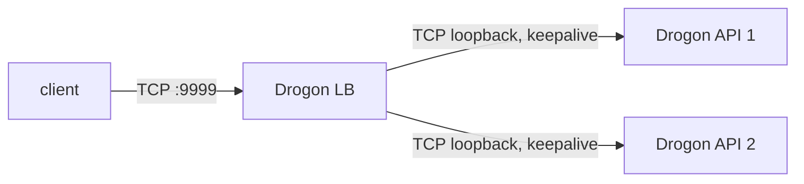

# rinha-2026-cpp-drogon


C++17 Drogon implementation for fraud detection to submit at [Rinha de Backend 2026](https://github.com/zanfranceschi/rinha-de-backend-2026).

## Architecture



Three Drogon-based services share a single Docker image:

| service | role                         | CPU  | mem    |
|---------|------------------------------|------|--------|
| lb      | Drogon reverse-proxy         | 0.20 | 40 MB  |
| api1    | `/fraud-score` + `/ready`    | 0.40 | 155 MB |
| api2    | `/fraud-score` + `/ready`    | 0.40 | 155 MB |

## Build

```bash
docker compose build
docker compose up
# server is on http://localhost:9999
```

For local dev (without docker):

```bash
cmake -S . -B build -G Ninja -DCMAKE_BUILD_TYPE=Release
cmake --build build
./build/api 8001 &
./build/api 8002 &
./build/lb 9999 127.0.0.1:8001 127.0.0.1:8002
```

## Endpoints

- `GET /ready` &mdash; 200 once both API instances are listening.
- `POST /fraud-score` &mdash; see [API.md](https://github.com/zanfranceschi/rinha-de-backend-2026/blob/main/docs/br/API.md).
